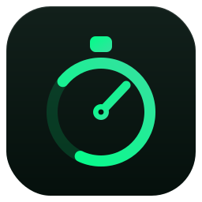
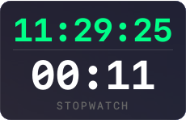

#  TimeHUD


A lightweight, transparent HUD overlay for Linux — shows a system clock and
stopwatch / countdown timer above fullscreen apps (YouTube, Netflix, etc.).

<p align="center">
  
</p>

---

## Quick start

```bash
# 1. Install dependencies (creates .venv automatically)
bash install.sh

# 2. Run
./timehud

# Or with a position override:
./timehud --position bottom-right
```

---

## Manual install (no venv)

```bash
pip install PyQt6 pynput
export PYTHONPATH="src:$PYTHONPATH"
python -m timehud.main
```

---

## Controls

### Overlay buttons

| Button | Action |
|--------|--------|
| ▶ / ⏸ | Start / pause timer |
| ↺      | Reset timer to zero |
| SW/CD  | Toggle Stopwatch ↔ Countdown mode |

### Timer Label Mouse Interactions
*You can also interact directly by clicking on the countdown/stopwatch numbers:*

| Action | Result |
|--------|--------|
| Single Click | Start / pause timer |
| Double Click | Reset timer to zero |
| Scroll Wheel | Toggle Stopwatch ↔ Countdown mode |

### Right-click context menu

- **Settings** – full settings dialog
- **Click-Through** – toggle mouse pass-through
- **Opacity** – quick opacity change
- **Position** – snap to screen corner
- **Quit**

### Keyboard shortcuts (overlay window focused)

| Key | Action |
|-----|--------|
| Space | Start / pause timer |
| R | Reset timer |
| Escape | Hide overlay |
| Ctrl+Q | Quit |

### Global hotkeys (requires `pynput`)

| Shortcut | Action |
|----------|--------|
| Ctrl+Shift+Space | Start / pause timer |
| Ctrl+Shift+R | Reset timer |
| Ctrl+Shift+H | Show / hide overlay |

---

## Settings

Right-click → **Settings** or edit `~/.config/timehud/config.json`:

```json
{
  "position": "top-right",
  "opacity": 0.88,
  "font_size": 30,
  "font_family": "Monospace",
  "timer_mode": "stopwatch",
  "countdown_duration": 300,
  "show_clock": true,
  "show_timer": true,
  "sound_enabled": true,
  "sound_interval": 60,
  "sound_file": "",
  "click_through": false,
  "alert_last_5_seconds": true,
  "auto_restart_countdown": false
}
```

### Position presets

`top-left` · `top-right` · `bottom-left` · `bottom-right` · `top-center` · `bottom-center`

You can also drag the overlay anywhere — the position is saved automatically.

### Sound alerts

Set `sound_interval` (seconds) and `sound_enabled: true`.  
Leave `sound_file` empty to use the built-in 880 Hz beep, or point it to any `.wav`/`.mp3`/`.ogg` file.

Requires one of these audio players: **paplay** (PulseAudio/PipeWire), **aplay**, **ffplay**, or **mpv**.

If `alert_last_5_seconds` is enabled, the timer will play short beeps at 5, 4, 3, 2, and 1 seconds remaining. On 0, it plays a long beep. Additionally, the timer text will flash its warning color on these exact seconds.

---

## Wayland note

By default the app runs under **XWayland** for reliable always-on-top behaviour above fullscreen apps.  
Pass `--wayland` to use the native Wayland backend (overlay may not appear above fullscreen in that mode).

---

## Packaging

### AppImage (via python-appimage)

```bash
pip install python-appimage
python-appimage build app .
```

